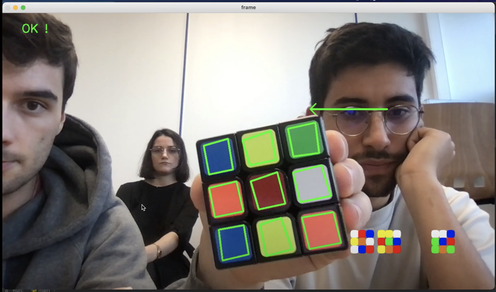
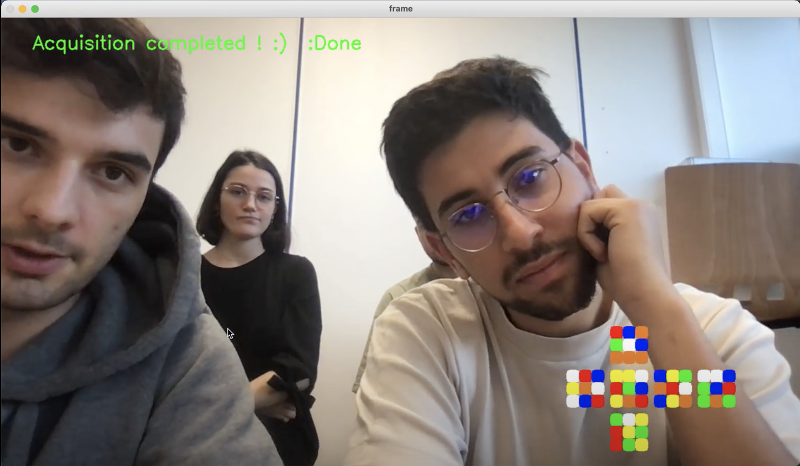
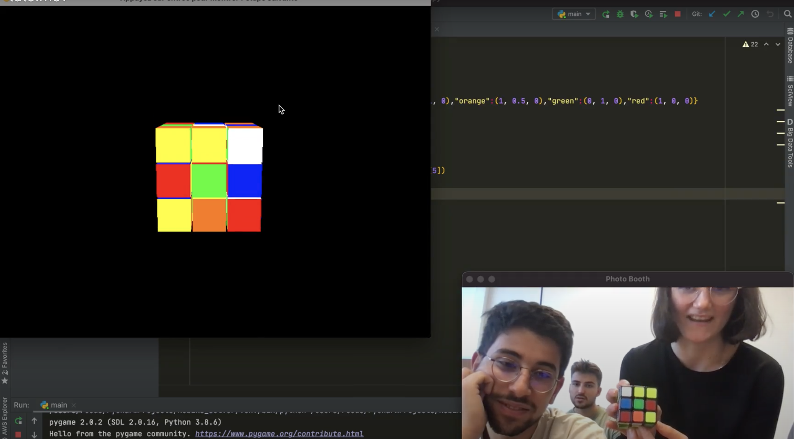
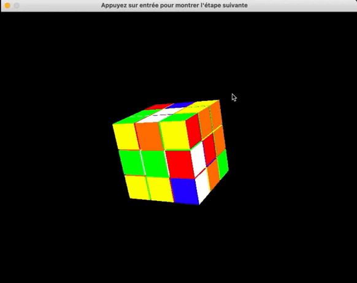

# Rubiks_solver
## Did you know ? 
- The number of possible combinations for a Rubik's cube is very large. It is estimated that there are about 43 quintillion (43 * 10^18) different possible combinations for a standard 3x3x3 Rubik's cube. To put this into perspective, this means that there are more possible combinations for a Rubik's cube than there are grains of sand on the planet Earth (7.5 x 10^18 grains of sand on Earth)
- Solving a Rubiks Cube means finding THE combination 1/(43*10^18) where the colour of each side is uniform. It is quite simple if you follow well-defined algorithms.
- The current world record for solving a Rubik's cube is 3.27 seconds, held by Yushung Du during his attempt in November 2018
## Objective
This is a group project carried out in 2020 during my Master 2 at IMT Nord Europe: 
- **HAMDOUCH Réda**
- **PAUBLANT Julien**
- **PETIT Alexandre**
- **SALIBA Louise**

- Our objective is to create a tool to help solve a Rubiks cube. The module is divided into two main parts: 
## Acquisition Part
- The user is invited to show the camera all 6 faces of the Rubiks cube, in the requested order (the faces are identified by the colour of the central square). When a face is shown to the camera, the tool records the configuration of the 9 squares that compose it.

*Snapchot of the acquisition process*

*When the acquisition is finished, a message is displayed on the camera. We can see a pattern representing the configuration of the rubiks on the lower right corner*

## Solver part
- Once the acquisition is finished: A 3D replica of the Rubiks with the configuration of the real Rubiks cube is proposed to the user. The user can rotate the camera using the directional arrows to display the Rubiks from all these angles. By pressing Enter, an animation of the Rubiks cube starts and changes its configuration. By following each animation one by one, the Rubiks cube will be solved. The user is then invited to perform the manipulation on the real Rubiks cube as displayed by the 3D module.

*Snapshot of the 3D representation of the Rubik's. The displayed face is the same as the one shown to the camera (with mirror effect)*

- *gif showing the stages of solving the Rubik's cube*

- Main technologies used: 
    - OpenCV for the acquisition 
    - Kociemba for the resolution of the Rubik's cube
    - OpenGL and pygame for the 3D replica

## How to use it ?
*(Only available in french, english version will be provided soon)?*

**Étapes pour faire fonctionner le Rubik’s Solver :**

- Télécharger le dossier de code et l’ouvrir dans un IDE python
- Créer un virtual environnement et l’activer ( . venv/bin/activate)
- Installer les librairies nécessaires (requirements) : pip install -r requirements.txt
- Exécuter le fichier main.py qui se trouve dans le dossier principal 

**La partie acquisition se lance :**

- Réaliser la calibration de la caméra : montrer les faces du rubik’s cube une à une comme indiqué en haut à gauche de l’écran. 
- Réaliser l’acquisition des faces : les faces sont demandées une à une en haut à gauche selon leur position (front, up, down, right, left, back), et un résumé des faces acquises s’affiche en bas à droite. S’il n’y a pas d’erreur l’acquisition est validée et il suffit d’appuyer sur ‘q’ pour quitter. 

**La partie Tutoriel se lance:** 

Le rubik’s cube s’affiche avec la configuration fournie lors de l’acquisition. L’affichage peut être modifié (rotation du cube) à l’aide des flèches du clavier. 
Afin de résoudre le rubik’s cube, il faut appuyer sur la touche entrée et une étape va être jouée à l’écran. En appuyant consécutivement sur cette touche, on arrive à la résolution du cube. 
Une fois terminé, il suffit de quitter la fenêtre. 

**Partie acquisition :**

La partie acquisition se décline en deux grandes étapes : 
-	La calibration des couleurs, qui permet de rendre notre détection invariante à la luminosité de l’environnement. Pour cela, l’utilisateur doit suivre les consignes qui consistent à afficher à l’écran la face dont le carré central est la couleur indiquée en haut de l’écran.
-	L’acquisition des faces : l’utilisateur présente une première face (aléatoire) du cube. Il doit suivre les consignes qui lui sont indiquées à l’écran (flèches) pour les faces suivantes. Durant ce processus, l’utilisateur devra remontrer la face frontale deux fois pour être sûr que l’orientation n’a pas changé.
Une fois l’acquisition finie, s’il n’y a pas d’erreurs liée à l’orientation. Un message de réussite est affiché à l’écran. L’utilisateur peut appuyer sur la touche “q” pour passer à la prochaine étape. Dans le cas contraire (acquisition erronée), un message d’erreur s’affiche et l’utilisateur doit recommencer l’acquisition des faces (sans passer par la calibration)

Technologies utilisées pour la détection : 
-	Utilisation de filtres: flou gaussien ,canny(),dilate() pour détecter l’ensemble des contours
-	Applications de conditions pour ne garder que les 9 contours correspondant aux facettes de la face:  propriétés d’un carré ( angle droit, cotés égaux) 
-	Distance entre l’objet et la caméra fixé à partir de la taille des surfaces des facettes
-	Détection des couleurs : on récupère la moyenne de la couleur de chaque facettes lorsqu’elle est acquise ( en RGB) et nous appliquons la distance CIE2000 avec les couleurs de références obtenues lors de la calibration.

 **Partie Animator :**
Nous avons utilisé pour cette partie la librairie OpenGL qui permet d’afficher et de faire des calculs sur les images 2D et 3D. Dans notre projet, les fonctions d’openGL nous ont permis de dessiner les 27 cubes qui composent le rubik’s-cube. 

Nous utilisons aussi le package « pygame » qui est très utilisé pour la conception de jeu vidéo en python. Sur ce projet, il permet de rendre le tutoriel interactif en appuyant sur la touche « ENTER » pour passer à l’étape suivante.  

Enfin nous avons comme pour la partie acquisition utilisée le package « kociemba » qui renvoie les étapes de mouvement pour résoudre un Rubik’s-cube. Nous avons ensuite traité ces données afin de matcher ces informations avec la représentation graphique.

Lors de la récupération des informations de l’acquisition, nous initialisons un rubik’s-cube résolu (toutes les faces ont une couleur unique). 
Dans un second temps, grâce à la fonction « solve » de kociemba, nous programmons les rotations inverse qui permet de mélanger le Rubik’s-cube. Cette étape est codée dans l’initialisation du cube entier, nous ne l’apercevons pas sur l’écran.
Enfin, nous affichons les rotations à faire pour résoudre le cube chaque fois que l’on appuie sur la touche « ENTER ».